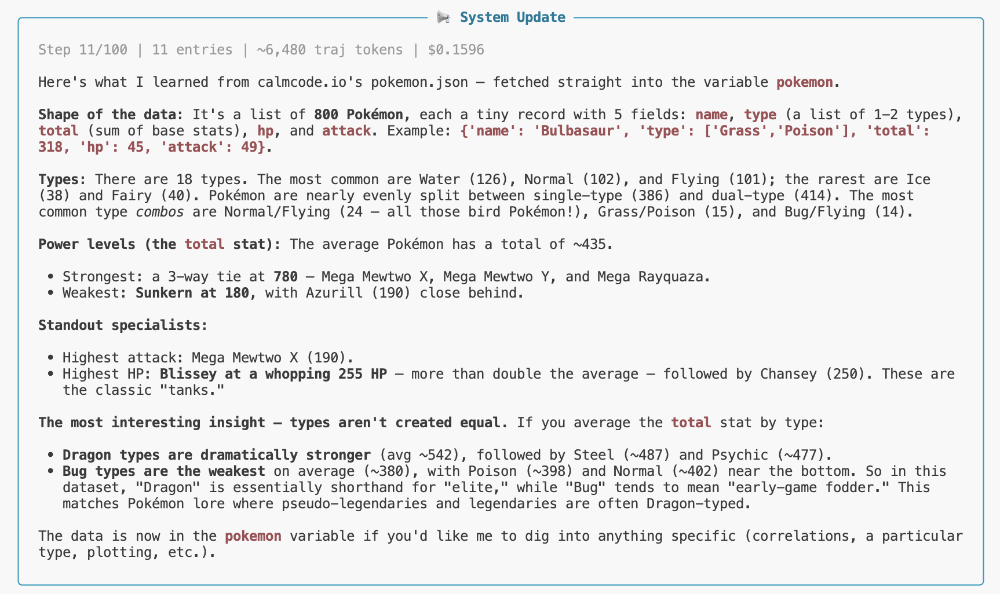

> **rlmy** is pronounced **"ar-leh-mee"** — like the letters **R-L-M** out loud ("ar-el-em"), but let them slur together. Think *"RLM-y."*

## What is this?

- An AI coding agent that runs in your terminal
- Uses DSPy's RLM framework — the LLM writes and executes Python code iteratively
- Connects to MCP servers (Slack, internal tools, etc.) as additional tools
- Maintains conversation state across turns (trajectory persistence)
- Supports cooperative interrupt (Ctrl+C pauses gracefully)

## Key Features

- **Iterative REPL**: LLM writes code, sees output, writes more code — until it solves the problem
- **MCP Integration**: Connect any MCP-compatible tool server
- **Filesystem Tools**: Read, write, edit files with safety guards (read-before-write)
- **Shell Access**: Run shell commands with deny-list safety and approval system
- **Trajectory Persistence**: Resume sessions where you left off
- **Conversation Continuity**: Prior context injected into new turns
- **Configurable Models**: Use any DSPy-compatible LM (Anthropic, Bedrock, OpenAI, Groq, Ollama)

## Prerequisites

- Valid LLM credentials (Anthropic API key, AWS profile for Bedrock, etc.)
- Python 3.12+ and Deno are installed automatically by the setup script

## Installation

Recommended (installs Deno + uv + rlmy in one command):

    curl -LsSf https://raw.githubusercontent.com/diego-lima/rlmy/main/setup_install.sh | bash

Alternative (if you already have Deno and uv):

    uv tool install rlmy

## Quick Start

    rlmy

- First run asks which AI model to use (model selection wizard)
- Workspaces are created in `~/.config/rlmy/sandboxes/`
- Ctrl+C pauses gracefully (doesn't lose work)

To skip the wizard (headless/CI):

    export RLM_MAIN_MODEL='bedrock/us.anthropic.claude-sonnet-4-6'
    export RLM_SUB_MODEL='bedrock/us.anthropic.claude-sonnet-4-6'
    rlmy

## Try It Out

If your credentials are set, run `rlmy` and type:

> *curl https://calmcode.io/static/data/pokemon.json straight into a variable and teach me something about it.*

Watch it fetch the data, explore it with code, and teach you something you didn't know. This is the RLM loop in action: it'll iterate until it has a neat insight.

## Configuration

- Priority: env vars > config file > wizard
- Config file: `~/.config/rlmy/config.toml`
- Supported model formats: any DSPy model string (e.g., `bedrock/us.anthropic.claude-sonnet-4-6`, `bedrock/us.anthropic.claude-opus-4-6-v1`)

## MCP Tools (optional)

- Config location: `~/.config/rlmy/mcp_servers.json`
- The setup script creates an empty template
- Edit it to connect Slack, internal tools, or any MCP-compatible server
- Agent starts without MCP if config is empty (no crash)

## CLI Options

- `--sandbox-root PATH`: Override sandbox directory (default: `~/.config/rlmy/sandboxes/`)
- `--cache-path PATH`: Override workspace cache file

## Architecture

- Built on DSPy's experimental RLM module
- InterruptableRLM: cooperative SIGINT + trajectory injection
- Sandboxed code execution via Deno + Pyodide (WASM)
- Tools are plain Python functions registered with DSPy

## License

MIT

## Status

- Early release — works well for the author, may have rough edges
- Feedback welcome via GitHub issues
